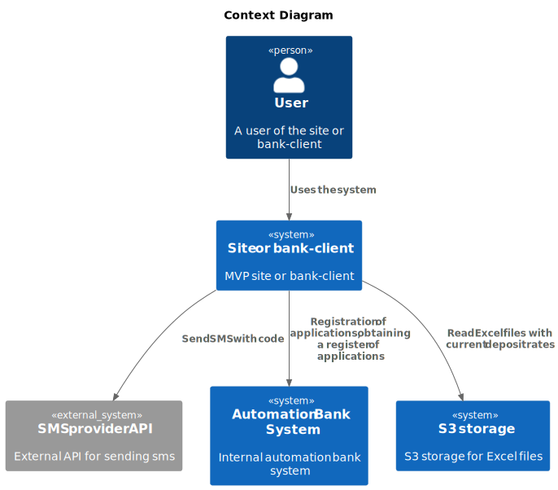
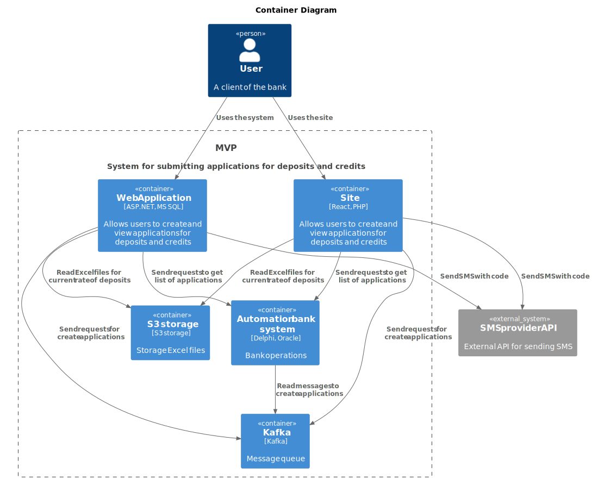

### **Название задачи:** MVP для сайта и банк-клиента
### **Номер задачи:** DT-001 MVP-1
### **Автор:** Демков Борис
### **Дата:** 21.07.25
### **Функциональные требования**
Верхнеуровневые Use Cases:

|**№**|**Действующие лица или системы**|**Use Case**|**Описание**|
| :-: | :- | :- | :- |
|UC1|Пользователь, сайт или интернет-банк|Регистрация| 1. Пользователь переходит на сайт или заходит в интернет-банк, нажимает на кнопку "Новый пользователь".  2. Указывает телефон, пароль, ФИО, запрашивает проверочный код через смс.  3. Вводит проверочный код, завершает регистрацию.|
|UC2|Пользователь, сайт или интернет-банк|Авторизация| 1. Зарегистрированный пользователь переходит на сайт или заходит в интернет-банк, нажимает на кнопку "Вход".  2. Указывает телефон, пароль, вводит одноразовый проверочный код из смс.  3. При успехе переходит на главную страницу.|
|UC3|Пользователь, сайт или интернет-банк, АБС|Просмотр главной страницы| 1. Пользователь просматривает на главной странице: актуальные ставки по депозитам, список заявок на депозиты, список заявок на кредиты.  2. Сайт или интернет-банк запрашивает АБС список заявок на депозит и кредит со статусами.   3. Сайт или интернет-банк читает Excel файл с актуальными ставками по депозитам из облачного хранилища.|
|UC4|Пользователь, сайт или интернет-банк, АБС|Подача заявки на депозит| 1. Пользователь нажимает на кнопку "Заявка на депозит" на главной странице. Указывает счет, сумму и срок депозита.  2. Сайт или интернет-банк отправляет заявку на рассмотрение в АБС через очередь сообщений Kafka.|
### **Нефункциональные требования**
Нефункциональные требования и архитектурно значимые требования:

|**№**|**Требование**|
| :-: | :- |
|R2|Сервис должен быть доступен 99,9% времени|
|U1|Отклик по всем операциям должен быть максимально быстрым и занимать миллисекунды|
|P2|Возможность горизонтального масштабирования и кеширования данных|
|+R1|Микросервисная архитектура, с возможностью использования Kuberbnetic и Kafka|
|+R4|Весь траффик между сайтом, клиент-банком и АБС должен быть шифрован|
### **Решение**

 
 

Команда АБС системы сообщает, что в текущей конфигурации система сильно нагружена, необходимо сделать взаимодействие между сайтом/банк-клиентом асинхронным. Поэтому предлагается реализовать очередь сообщений для создания заявок и кеширование информации о реестре заявок.
### **Альтернативы**
В качестве альтернативы можно рассмотреть решение, когда функионал заявок будет реализован исключительно в банк-клиенте, с сайта налажена переадресация пользователя для получения данной услуги.

**Недостатки, ограничения, риски**

Мы реализовывем две точки получения одинакового функционала, это трудозатратно, сложно поддерживается и может приводит к различии отображаемой информации на сайте и банк-клиенте. К тому же это кажется не безопасным решением. Отдельно необходимо выделить использование Excel файлов для хранения актуальных ставок по депозитам, современным решением было бы использовать для этого отдельный сервис.

