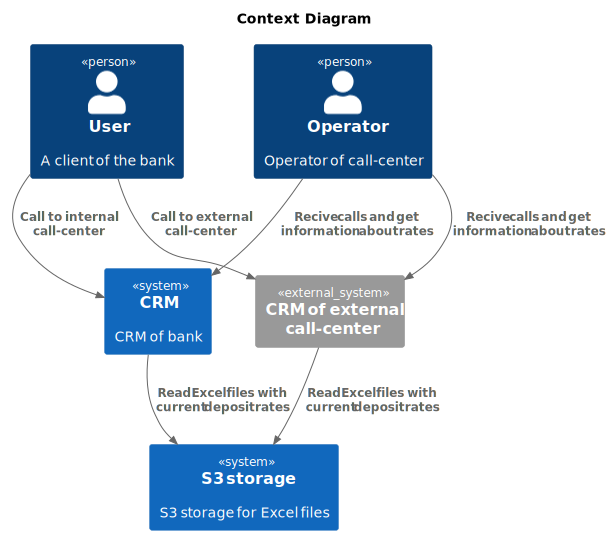
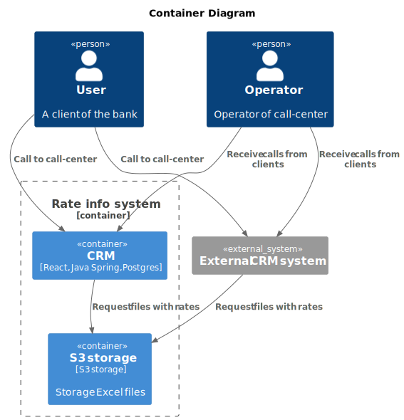

### **Название задачи:** Работа колл-центра по ставкам депозитов
### **Номер задачи:** DT-001 Call-1
### **Автор:** Демков Борис
### **Дата:** 22.07.25
### **Функциональные требования**
Опишите здесь верхнеуровневые Use Cases:

|**№**|**Действующие лица или системы**|**Use Case**|**Описание**|
| :-: | :- | :- | :- |
|UC1|Клиент, сотрудник колл-центра|Получение информации по ставкам|1. Клиент звонит сотруднику колл-центра, представляется.   2. Сотрудник колл-центра скачивает соответствующий файл c S3.   3. Сотрудник кол-центра предоставляет информацию по ставкам клиенту|
### **Нефункциональные требования**
Опишите здесь нефункциональные требования:

|**№**|**Требование**|
| :-: | :- |
|+R3|Необходимо иметь возможность найти и скачать Excel файл со ставками клиента c S3 хранилища|
### **Решение**
 
 
### **Альтернативы**
Обмен файлами и передача информации через файл, особенно со сторонними подрядчикми видится как прошлый век! Альтернативное решение реализовать передачу информации по ставкам через отдельный API сервис. Не выбирать подрядчиков не готовых работать по современному протоколу обмена данными. 
Так же в качестве кол-центра можно расмотреть создание голосового чат-бота, который сможет предоставлять такую информацию, при этом такого чат-бота легко масштабировать.

**Недостатки, ограничения, риски**

Часть недостатков описана выше. Здесь можно добавить еще проблемы с безопасностью при передаче файлов сторонним подрядчикам.

